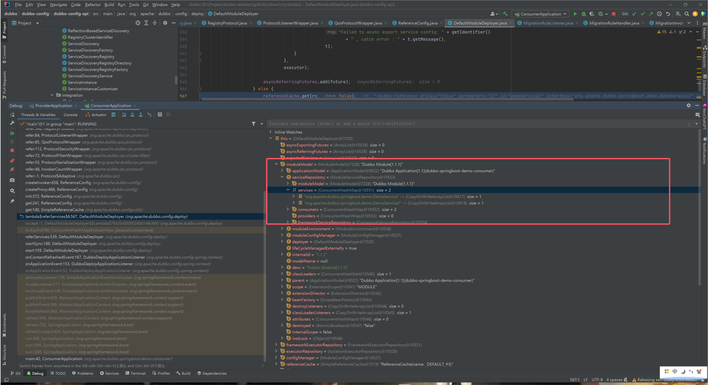

# 关键类

ListenableStateRouter#process -> ConditionRuleParser#parse -> 生成 ConditionRouterRule对象，然后在

ListenableStateRouter类中将对象转换成 state/StateRouter

ListenableStateRouter中的process方法，将会处理rawConfig变成 ConditionRouterRule，成最终的东西

看一下Factory的@active的优先级，可以确定构建 chain的上下级关系

在构建 Chain的时候，ServiceStateRouter的ruleKey就已经初始化好了，是根据 Url来构建取的
如：org.apache.dubbo.springboot.demo.DemoService::   org.apache.dubbo.springboot.demo.DemoService2::

ProviderAppStateRouter也是根据Url来取application的名字
如： dubbo-springboot-demo-consumer

chain构建的时候是跟 Interface相关的，一个Interface对应的就是一个 chain，所以才有了AppStateRouter的单例实现

在moduleModel中存储着service实例

