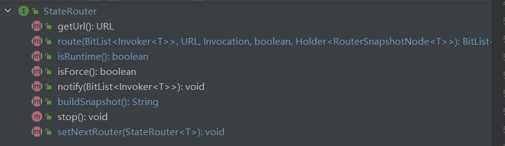
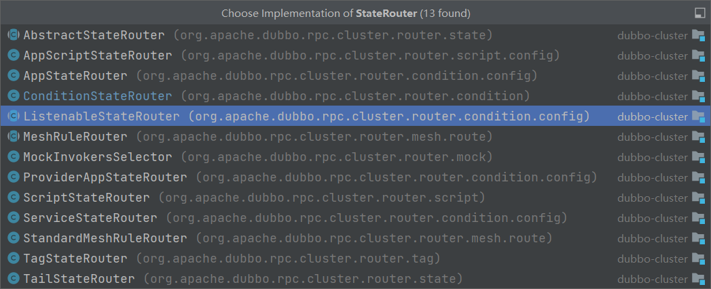
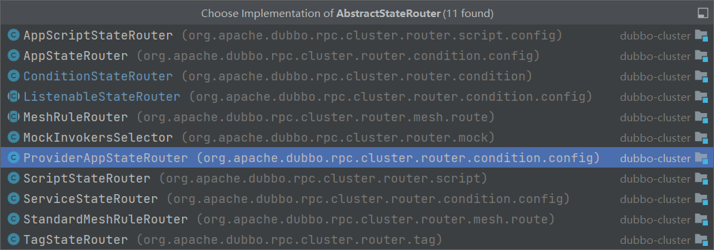
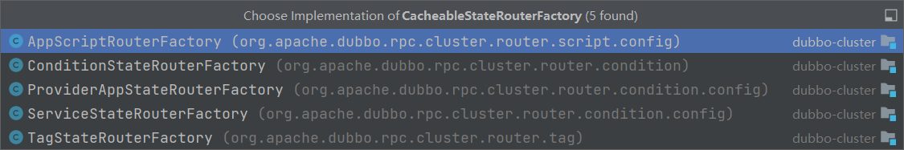

# 关键类

StateRouter接口

只定义这些方法：

其实现类有：

AbstractStateRouter类是对StateRouter接口的抽象实现

并且都是工厂模式，StateRouterFactory就是用来生成 StateRouter使用的，此外还有一个CacheableStateRouterFactory类是2.7.0出来的

并且说最新的路由器实现应该继承这个类

围绕 StateRouter 接口展开的包，其中有一些工厂模式，以及静态类实现
