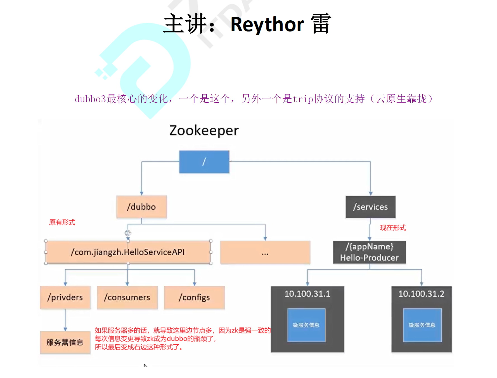
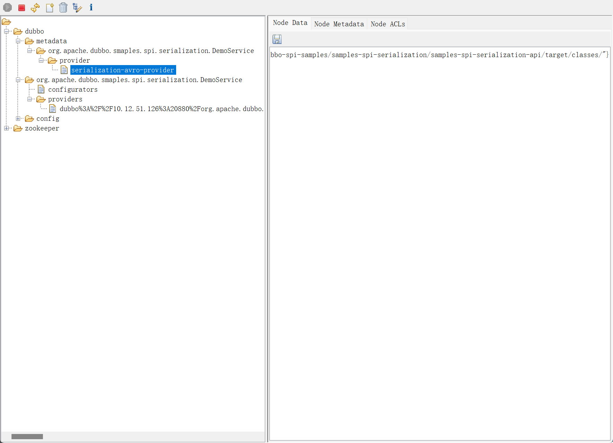
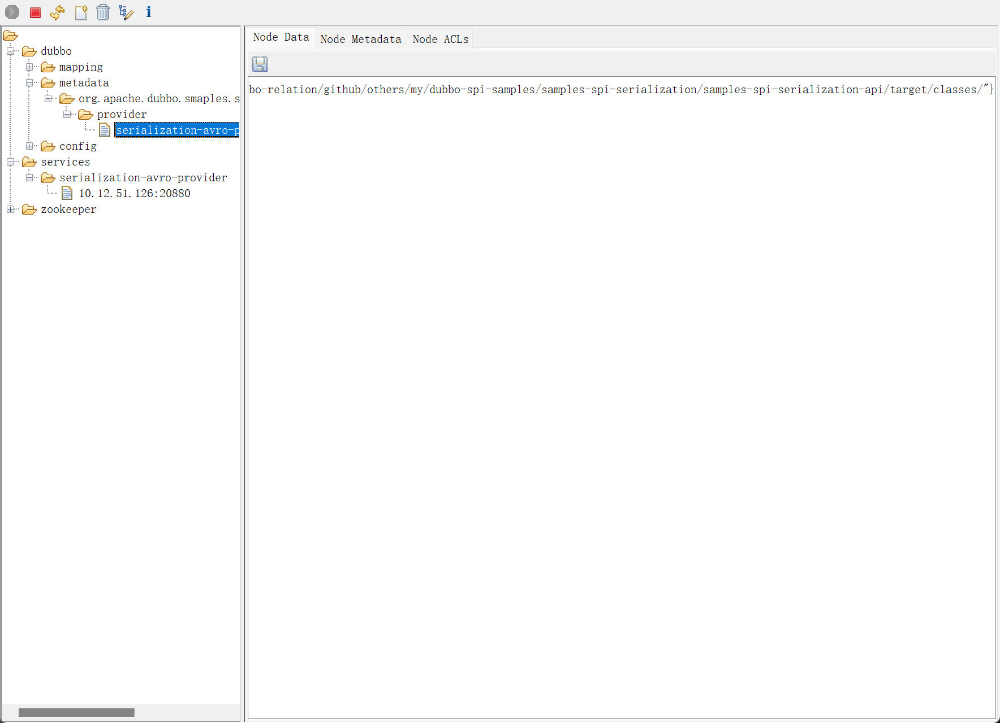
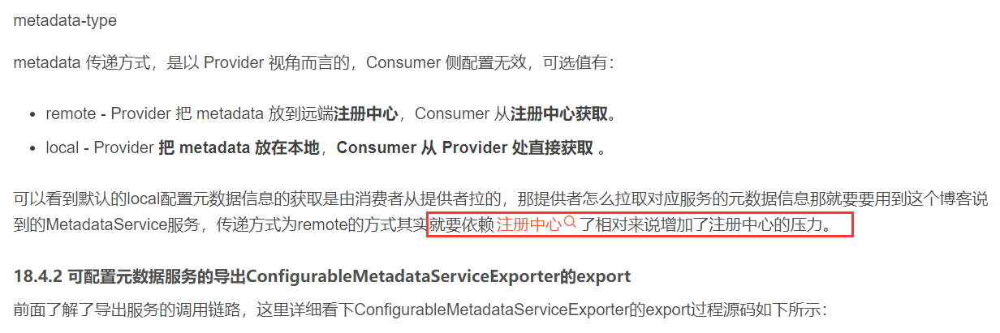

# 新版和老版本在注册服务上的区别：

# 3.x的interface注册

metadata没有指定，默认就是直接上来了

# 3.x的instance注册

metadata似乎是后来才出来的，所以第一个图中没有涉及到，metadata就是在dubbo根目录下那边的，没有指定metadata地址就默认使用的 registry的地址吧似乎是

# dubbo官网给的解释：

https://cn.dubbo.apache.org/zh-cn/blog/2023/01/30/dubbo3-%E5%BA%94%E7%94%A8%E7%BA%A7%E6%9C%8D%E5%8A%A1%E5%8F%91%E7%8E%B0%E8%AE%BE%E8%AE%A1/

首先是从注册中心收到精简后的地址，随后通过调用 MetadataService 元数据服务，读取对端的元数据信息。在收到这两部分数据之后，消费端会完成地址数据的聚合，最终在运行态还原出类似 Dubbo2 的 URL 地址格式。因此从最终结果而言，应用级地址模型同时兼顾了地址传输层面的性能与运行层面的功能性。

# 模块发布的启动生命周期方法

DefaultModuleDeployer类型的start方法：

> 模块启动成功之后的方法 onModuleStarted();，在这个方法中会去发布服务元数据信息。

# 服务暴露了相关模块找不到

其实是在 registry-api中定义的上层的东西，比如MetadataServiceDelegation类就是提供remote远程的方式

默认的配置元数据是local不会直接把应用的元数据注册在元数据中心，有local file进行注册的，默认的是会到provider端进行fetch，存储在provider端的file中
https://blog.csdn.net/songjunyan/article/details/124779102
默认的是使用注册中心作为元数据中心

逻辑有误，无论是什么元数据中心配置，provider端都是会写入文件中的。并且数据是先产生到内存中的，然后内存中会设置任务，定时同步到文件和元数据中心上。

